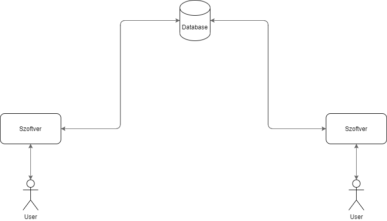
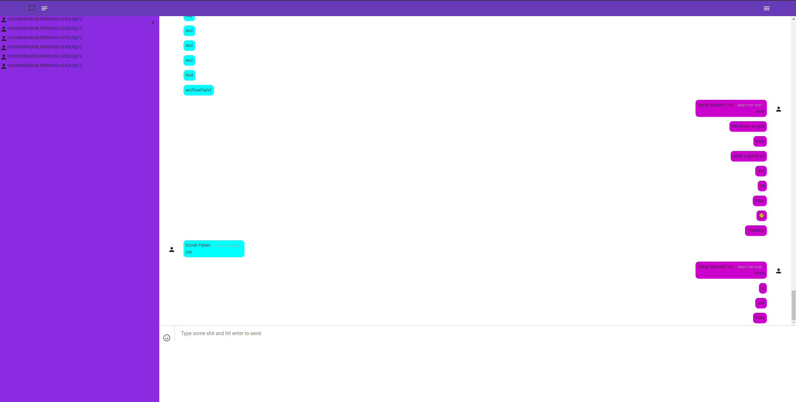
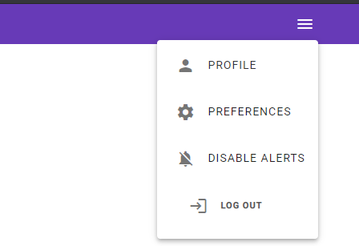
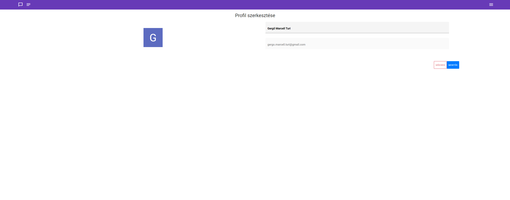

Funkcionális Specifikáció
=========================

## 1. A rendszer céljai és nem céljai

#### A rendszer célja
Ne kelljen egy számológépet elővenni-e az embernek mikor a gép előtt ül.

Ezáltal támogatást nyújt alkalmazottak munkájához.

Könnyü kezelési és felhasználói felületet biztosítson.

Teljes megoldást biztosítson az emberek számára a számításokhoz.

Teljes mértékben személyre szabható legyen, ezzel hatékonyabbá téve az egyes részlegeken a munkáját.

Többnyelvűség implementálása

#### A rendszernek nem célja
Felvenni a versenyt más chatapplikációkkal

Általános chatapplikációs igények kielégítése

## 2. Jelenlegi helyzet leírása
Az egyre csak növekvő cégek esetében mára már nem célratörő az email-es levelezés; sok esetben azonnali és valós idejű kommunikáció szükséges.

Ezen igény természetesen nem csak nagyvállalatok esetében igaz, hisz a rohamosan globalizálódó világban mára már életünk minden részén szükséges valamilyen eszköz
ami gyors és könnyű kommunikáció tesz lehetővé a felhasználóknak.

Ez a fajta kommunális igény viszont magában hordoz néhány extra igényt; mivel mára már nagyobb cégek elérhetővé tettek olyan nagy lefedettségű applikációkat
melyek az igények nagy részét lefedik, speciális célokra alkalmazott üzenetváltó programok elkészítése is szükségessé vált.

Ilyen program elkészítése olyan cégeknek szükséges, akik egyrészt el akarnak válni a nagyobb cége által fejlesztett általános chat-programoktól, másrészről
pedig olyan igényekkel rendelkeznek, amiket hasonló programok nem tudnak kielégíteni általánosságuk miatt.

## 3. Vágyálom rendszer leírása

Projektunk célja, hogy egy egyszerű chat applikációt hozzunk létre, mely könnyen testreszabható és egy ugrókőként tud szolgálni.

A program kompakt lesz és egyszerű, viszont könnyen bővíthető és fejleszthető, ezzel teret adva jövőbeli testreszabásának más cégek esetében is. 

Könnyű és átlátható UI-val (User Interface) egyszerűvé téve a program felületét.

Ez a szoftver minden kommunikációs igényt ki fog szolgálni mely a céges megrendelőnek külön kérése volt.

Modern dizájn és reszponzív megjelenítés segítségével elérjük a könnyű kezelhetőséget nem csak az fiatalabb és középkorú generációnak, de megcélozzuk a 69+ éves emberek tömegét is.

## 4. A rendszerre vonatkozó külső megszorítások: pályázat, törvények, rendeletek, szabványok és ajánlások felsorolása
#### 3.1 Pályazat

A pályázatíró feladatkörébe tartozik az új pályázati lehetőségek felkutatása,
az erről történő tájékoztatás adott vállalatok és partnerek felé,illetve igény esetén a pályázatok megírása magyar vagy idegen nyelven. 

A pályázatíró feladata a pályázati úton történő forrásszerzés az adott vállalat vagy szervezet fejlesztési céljainak megvalósítása érdekében.

Munkájára elsősorban a pályázatok sokszor bonyolult megszövegezése, a vonatkozó jogszabályok és eljárások ismeretének igénye miatt van szükség.

#### 3.2 Törvények

A törvény mint jogi fogalom a jogszabályok hierarchiájában az alkotmány után a legfőbb jogszabályt jelenti, amelyet csak az adott állam törvényhozása alkothat meg, módosíthat vagy helyezhet hatályon kívül.

A köznyelv törvény alatt esetenként a jog egészét, bármelyik jogszabályt illetve a bíróságot is érti.

#### 3.3 Szabványok

A szabvány elismert szervezet által alkotott vagy jóváhagyott, közmegegyezéssel elfogadott olyan műszaki dokumentum, amely tevékenységre vagy azok eredményére vonatkozik, és olyan általános és ismételten alkalmazható szabályokat, útmutatókat vagy jellemzőket tartalmaz, amelyek alkalmazásával a rendező hatás az adott feltételek között a legkedvezőbb.

## 5. Jelenlegi üzleti folyamatok modellje

5.1 Számolási müveletek: 

5.1.1 Számolási igény bekérése => online számológépének megnyitása => számolási müvelet elvégzése

5.1.2 Syntax error => értelmezhetetlen karakterk vagy müvleti jelek => hiba megjelenítése 

5.2 Személyre szabás:
 
5.2.1 A számológép bizonyos esetekben nem megfelelő => különböző helyen lévő beállítás elvégzése => bonyolult testreszabás müveletek

## 6. Igényelt üzleti folyamatok modellje

5.1 Üzenetküldési müveletek: 

5.1.1 Üzenetküldési vagy fogadási igény => online webapplikáció megnyitása => üzenet küldése vagy fogadása

5.1.2 Üzenetküldés => Adatbázisba való mentés => Üzenet megjelenítése adatbázisból.

5.2 Személyre szabás:
 
5.2.1 A számológép bizonyos esetekben nem megfelelő => különböző helyen lévő beállítás elvégzése => bonyolult testreszabás müveletek

## 7. Követelménylista
1. UI
2. Menő design
3. Grafikus megjelenítés
    - Chatablakok megjelenítése
    - Gombok megkülönböztetése
4. Üzenetváltási műveletek
    - Küldés
    - Fogadás
    - Dátum megjelenítése
    - Küldő megjelenítése
    - Fogadó megjelenítése
    - Üzenetek automatikus frissítése

## 8. Használati esetek

## 9. Képernyő tervek

## 10. Forgatókönyvek

1.A kolléga jelezni akar, hogy késni fog a meetingről.
Megnyitja a webapplikációt.
Bejelentkezik, ha eddig nem tette meg (automatikus bejelentkezés is elérhető)
Kiválasztja a projektvezetőt, vagy a meeting-es chatkonferenciát
Üzenetet küld, hogy késni fog.

2.A vállalatvezető írni akar minden kollégájának valamilyen céges, mégsem formális dologról.
Megnyitja a webapplikációt.
Kiválasztja a super-chatet, amiben mindenki benne van a cégben.
Üzenetet küld a super-chatbe, amit minden alkalmazottja láthat.

## 11. Funkció – követelmény megfeleltetés
 Az oldal dizájnját  CSS-el csináljuk, könnyen értelmezhető HTML-el kódoljuk.
 
A reszponzív design CSS segítségével történik, hogy átméretezhető legyen az ablak, és számos felbontással kompatibilis legyen.

A kliens oldalt Angular framework-el valósítjuk meg.

A Server oldalt Firebase API-val érjük el.

A program kompatibilis lesz különböző eszközökkel, a legnépszerűbb böngészők segítségével.

## 12. Fogalomszótár

Chatapplikáció:
Egy olyan digitális szoftver, mely egyszerű szöveges üzenetek valós idejű küldésére és fogadására alkalmas.

Autentikáció:
Olyan folyamat, mely ellenőrzi programot használó személy hitelesítési adatait, és jogkört rendel hozzá.

