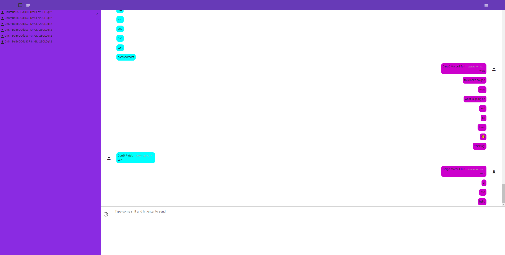
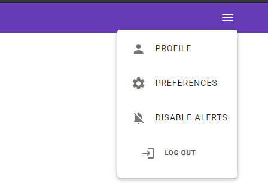
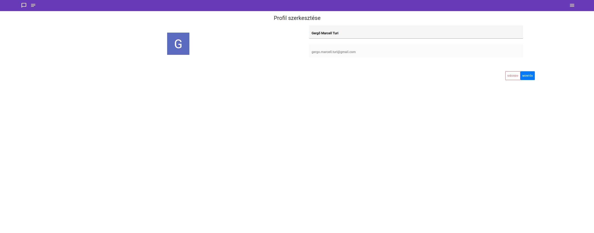

Rendszerterv
============
## A rendszer céljai és nem céljai

#### A rendszer célja
Egy belső, kisebb cég számára létrehozni egy webaplikációt, melyen keresztül a valós idejű belső kommunikáció könnyítése valósúlhat meg.

Ezzel a programmal függetlenné tudják magukat tenni más, third-party szoftverektől és nagyobb cégektől.

A saját webapplikáció lehetőséget nyújt ahhoz, hogy személyre szabott terméket kaphassanak, specializálva a cég érdekeihez és szükségeihez.

#### A rendszernek nem célja

Nem célja a webapplikációnak új szintre emelni a valós idejű üzenetváltás élményét.

Csak és kizárólag belső céges szoftver.

## Rendszer használati esetei, lefutásaik ábra

## Tervek

#### Ütemterv:
Projekt kezdete: 2020.10.08.

Követelményspecifikáció határideje: 2020.10.15.

Funkcionális specifikáció határideje: 2020.10.19.

Rendszerterv határideje: 2020.10.23.

Projekt elkészítésének határideje: 2020.11.29.

#### A projekt résztvevői:
A projekten 3 db programtervező informatikus hallgató dolgozik.

Tóth János Donát (fejlesztő)

Pataki Donát (fejlesztő)

Turi Marcell Gergő (fejlesztő)

## Wireframe

## Rendszer célja

A rendszer célja, hogy egy egységes felületet biztosítson a cég emberei számára a kommunikáció elvégzéséhez.

A legfőbb cél, hogy az alkalmazás különböző fajta eszközökön is működjön, reszponzív design alkalmazásával.

Web eszközök használata szükséges: HTML, CSS.

Emoji karakterek implementálása és könnyű hozzáférése

A felhasználói felület, illetve a megjelenés legyen testreszabható, ezzel hatékonyabbá téve az egyes részlegeken dolgozók munkáját.
 
A felületnek egyszerünek és kezelhetőnek kell lennie, hogy mindenki könnyen tudja használni. 

A rendszernek célja, hogy ne kelljen third-party szoftvereket használni cégen belüli digitális üzenetváltásokhoz.

## Fizikai környezet

#### Angular Frontend

Visual Studio Code

Intellij Idea

Sublime Text

Notepad++

#### Fejlesztő eszközök
HTML

CSS

TS

#### Böngészők:

Firefox

Google Chrome

Opera

## Tesztterv

Külső megjelenés tesztelése.

Adatbázis elérhetőségének tesztelése.

Adatbázisműveletek indítása frontend oldalról.

Autentikáció tesztelése

Üzenetek automatikus frissülése.

## Telepítési terv

A program nem kíván telepítést, mivel egy weboldal ezt pedig a programozó cég rendszergazdája üzemeli egy szerven.

## Karbantartási terv

Tudjuk, hogy az informatika egy folyamatosan újulásban lévő iparág, fontosnak tartjuk, hogy naprakészek maradjunk a technológiákkal kapcsolatban.
 
A weblapunkat átadás után is karbantartjuk, illetve korszerűsítjük is időközönként.

Havi updateket tervezünk a weboldal számára.

A jövőben szeretnénk évszakhoz vagy esetleg egyes ünnepekhez külőn dizájnt is fejleszteni.
